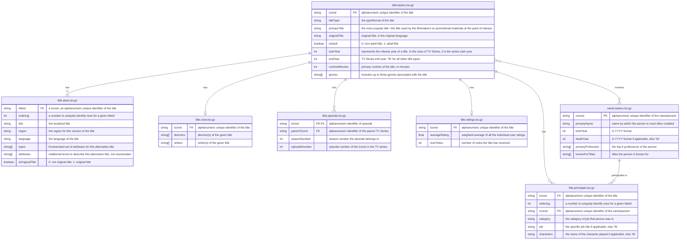

```mermaid
erDiagram
    TITLE["title.basics.tsv.gz"] {
        string tconst PK "alphanumeric unique identifier of the title"
        string titleType "the type/format of the title"
        string primaryTitle "the more popular title / the title used by the filmmakers on promotional materials at the point of release"
        string originalTitle "original title, in the original language"
        boolean isAdult "0: non-adult title; 1: adult title"
        int startYear "represents the release year of a title. In the case of TV Series, it is the series start year"
        int endYear "TV Series end year. '\N' for all other title types"
        int runtimeMinutes "primary runtime of the title, in minutes"
        string[] genres "includes up to three genres associated with the title"
    }
    TITLE_AKA["title.akas.tsv.gz"] {
        string titleId FK "a tconst, an alphanumeric unique identifier of the title"
        int ordering "a number to uniquely identify rows for a given titleId"
        string title "the localized title"
        string region "the region for this version of the title"
        string language "the language of the title"
        string[] types "Enumerated set of attributes for this alternative title"
        string[] attributes "Additional terms to describe this alternative title, not enumerated"
        boolean isOriginalTitle "0: not original title; 1: original title"
    }
    TITLE_CREW["title.crew.tsv.gz"] {
        string tconst FK "alphanumeric unique identifier of the title"
        string[] directors "director(s) of the given title"
        string[] writers "writer(s) of the given title"
    }
    TITLE_EPISODE["title.episode.tsv.gz"] {
        string tconst PK,FK "alphanumeric identifier of episode"
        string parentTconst FK "alphanumeric identifier of the parent TV Series"
        int seasonNumber "season number the episode belongs to"
        int episodeNumber "episode number of the tconst in the TV series"
    }
    TITLE_PRINCIPALS["title.principals.tsv.gz"] {
        string tconst FK "alphanumeric unique identifier of the title"
        int ordering "a number to uniquely identify rows for a given titleId"
        string nconst FK "alphanumeric unique identifier of the name/person"
        string category "the category of job that person was in"
        string job "the specific job title if applicable, else '\N'"
        string characters "the name of the character played if applicable, else '\N'"
    }
    TITLE_RATINGS["title.ratings.tsv.gz"] {
        string tconst FK "alphanumeric unique identifier of the title"
        float averageRating "weighted average of all the individual user ratings"
        int numVotes "number of votes the title has received"
    }
    NAME["name.basics.tsv.gz"] {
        string nconst PK "alphanumeric unique identifier of the name/person"
        string primaryName "name by which the person is most often credited"
        int birthYear "in YYYY format"
        int deathYear "in YYYY format if applicable, else '\N'"
        string[] primaryProfession "the top-3 professions of the person"
        string[] knownForTitles "titles the person is known for"
    }

    TITLE ||--o{ TITLE_AKA : "has"
    TITLE ||--o| TITLE_CREW : "has"
    TITLE ||--o{ TITLE_EPISODE : "has"
    TITLE ||--o{ TITLE_PRINCIPALS : "has"
    TITLE ||--o| TITLE_RATINGS : "has"
    TITLE }o--o{ NAME : "involves"
    NAME ||--o{ TITLE_PRINCIPALS : "participates in"
```