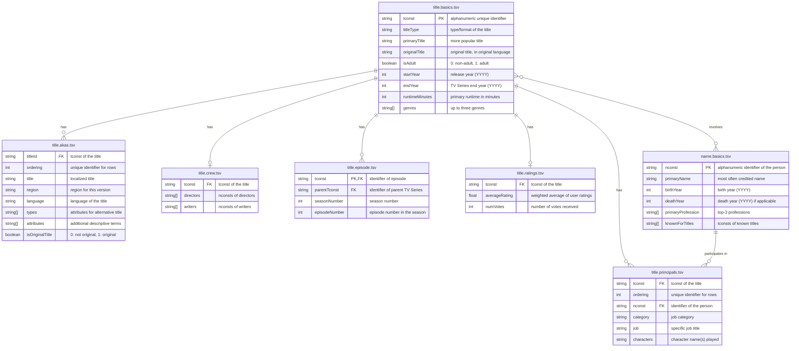

```mermaid
erDiagram
    TITLE["title.basics.tsv"] {
        string tconst PK "alphanumeric unique identifier"
        string titleType "type/format of the title"
        string primaryTitle "more popular title"
        string originalTitle "original title, in original language"
        boolean isAdult "0: non-adult, 1: adult"
        int startYear "release year (YYYY)"
        int endYear "TV Series end year (YYYY)"
        int runtimeMinutes "primary runtime in minutes"
        string[] genres "up to three genres"
    }
    TITLE_AKA["title.akas.tsv"] {
        string titleId FK "tconst of the title"
        int ordering "unique identifier for rows"
        string title "localized title"
        string region "region for this version"
        string language "language of the title"
        string[] types "attributes for alternative title"
        string[] attributes "additional descriptive terms"
        boolean isOriginalTitle "0: not original, 1: original"
    }
    TITLE_CREW["title.crew.tsv"] {
        string tconst FK "tconst of the title"
        string[] directors "nconsts of directors"
        string[] writers "nconsts of writers"
    }
    TITLE_EPISODE["title.episode.tsv"] {
        string tconst PK,FK "identifier of episode"
        string parentTconst FK "identifier of parent TV Series"
        int seasonNumber "season number"
        int episodeNumber "episode number in the season"
    }
    TITLE_PRINCIPALS["title.principals.tsv"] {
        string tconst FK "tconst of the title"
        int ordering "unique identifier for rows"
        string nconst FK "identifier of the person"
        string category "job category"
        string job "specific job title"
        string characters "character name(s) played"
    }
    TITLE_RATINGS["title.ratings.tsv"] {
        string tconst FK "tconst of the title"
        float averageRating "weighted average of user ratings"
        int numVotes "number of votes received"
    }
    NAME["name.basics.tsv"] {
        string nconst PK "alphanumeric identifier of the person"
        string primaryName "most often credited name"
        int birthYear "birth year (YYYY)"
        int deathYear "death year (YYYY) if applicable"
        string[] primaryProfession "top-3 professions"
        string[] knownForTitles "tconsts of known titles"
    }

    TITLE ||--o{ TITLE_AKA : "has"
    TITLE ||--o| TITLE_CREW : "has"
    TITLE ||--o{ TITLE_EPISODE : "has"
    TITLE ||--o{ TITLE_PRINCIPALS : "has"
    TITLE ||--o| TITLE_RATINGS : "has"
    TITLE }o--o{ NAME : "involves"
    NAME ||--o{ TITLE_PRINCIPALS : "participates in"
```